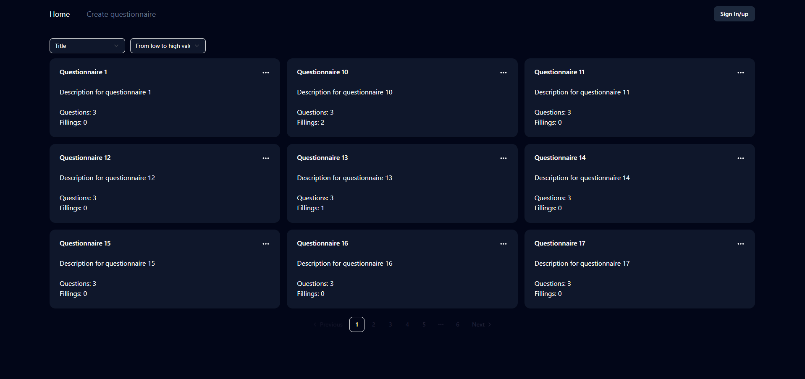
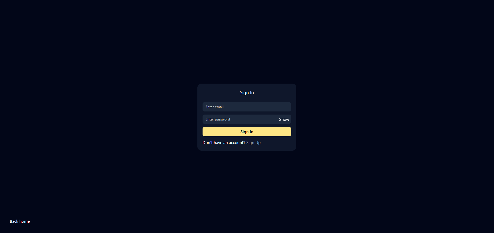
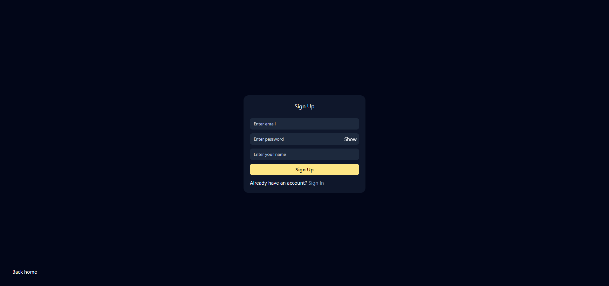
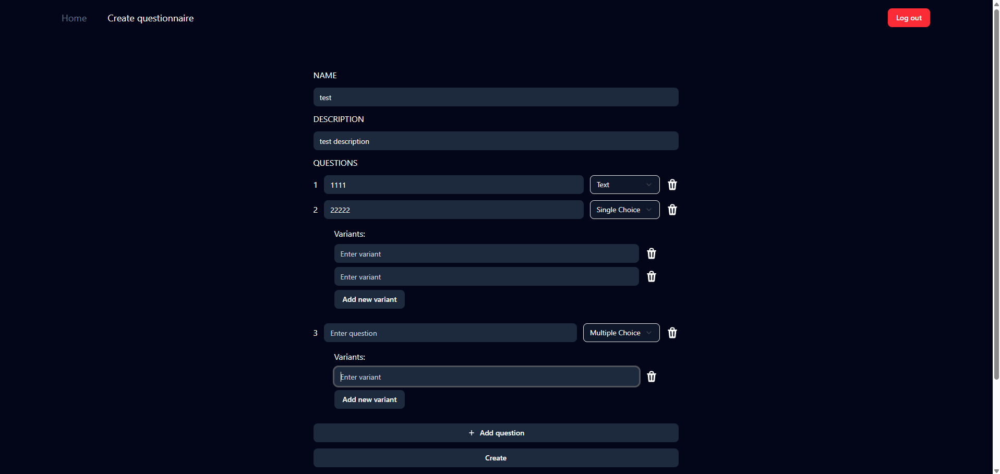
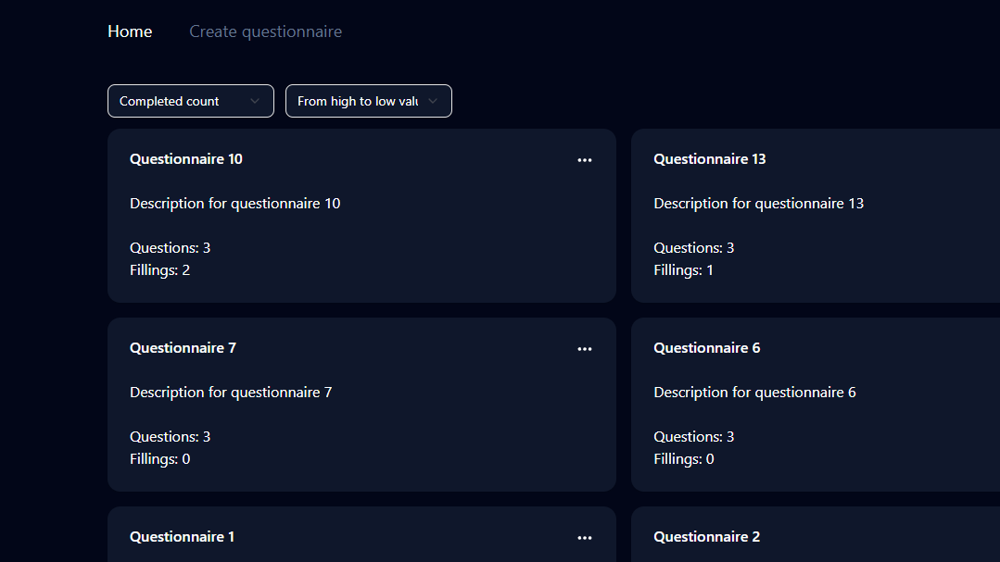
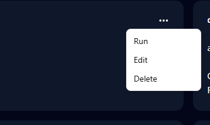
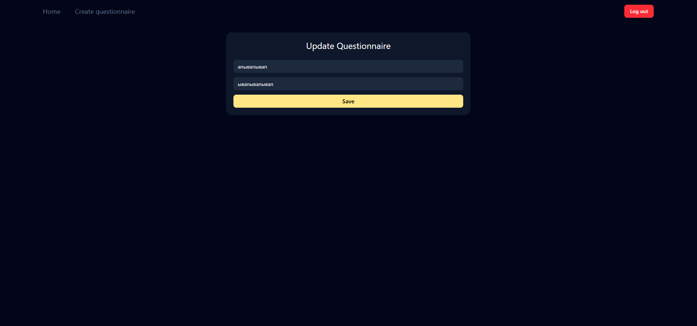
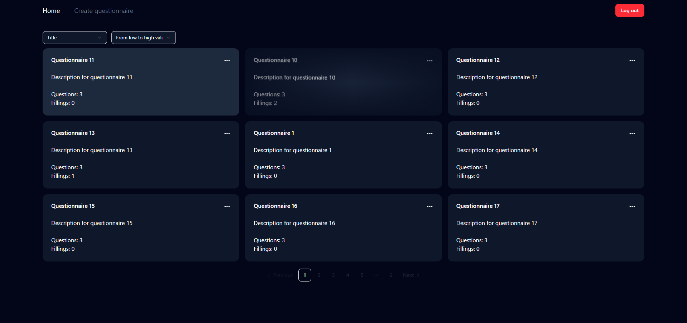
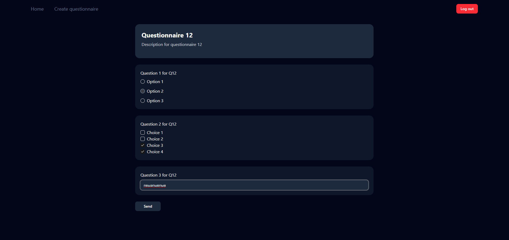
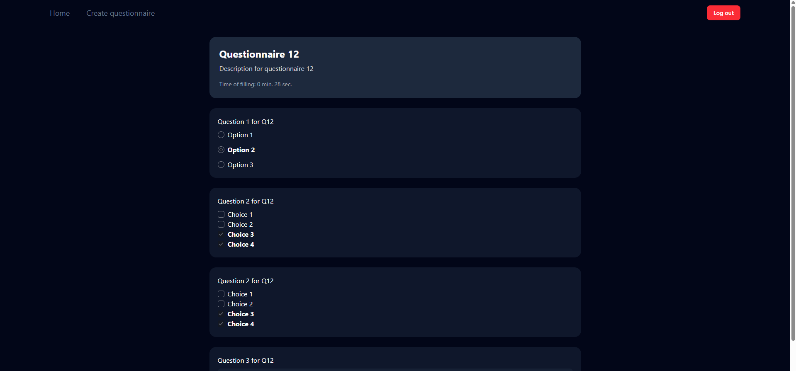

# ElifTech test assignment

2 of 3 levels completed.

## What was done

- Authorization
- CRUD operations questionnaires
- Pagination and sorting of questionnaires
- Ability to fill out questionnaires and view results
- Drag and drop questionnaires
- Saving answers before submitting the form
- Ability to select the type of answer (text, multiple choice and single choice)
- Ability to add questions and answer options as many as you want

## Technologies

### Front-End

- Next.js
- TypeScript
- Tailwindcss
- React-Query
- Shadcn/ui
- React-hook-form
- Zod

### Backend

- NestJS
- PostgreSQL
- Prisma
- TypeScript
- Docker

### Assembly

- Turbo Monorepo

## Application architecture

```
├── apps/                        # Applications
│   ├── api/                     # Backend (NestJS)
│   │   ├── node_modules/        # Dependencies
│   │   ├── prisma/              # Database settings (Prisma)
│   │   ├── src/                 # Source code
│   │   │   ├── [module]         # Application modules (e.g., auth)
│   │   │   ├── common/          # Common utilities
│   │   │   └── utils/           # Helper functions
│   │   ├── test/                # Tests
│   │   └── [config files]       # Configuration files (.env, tsconfig, etc.)
│   ├── web/                     # Frontend (Next.js)
│   │   ├── node_modules/        # Dependencies
│   │   ├── public/              # Static files
│   │   ├── src/                 # Source code
│   │   │   ├── components/      # Reusable components
│   │   │   ├── lib/
│   │   │   ├── modules/         # Logic modules
│   │   │   │   ├── [module]     # Modules (e.g., auth)
│   │   │   └── pages/           # Application pages
│   │   └── [config files]       # Configuration files (next.config, etc.)
├── [root config files]          # Global configurations
```

## Installation

### Installing dependencies

```
npm i
```

### Running a Database in a Docker Container

```
npm run docker
```

### Generating tables in a database

```
npx prisma generate
```

### Launching applications

```
npm run dev
```

### Application demo

<div>
  
  <p style="text-align:center">The main screen of the application</p>
</div>
<div>
  
  <p style="text-align:center">Login Page</p>
</div>
<div>
  
  <p style="text-align:center">Registration page</p>
</div>
<div>
  
  <p style="text-align:center">Form creation page</p>
</div>
<div>
  
  <p style="text-align:center">Sorting demonstration</p>
</div>
<div>
  
  <p style="text-align:center">If you are the owner, you can manage</p>
</div>
<div>
  
  <p style="text-align:center">Questionnaire update page</p>
</div>
<div>
  
  <p style="text-align:center">Demonstration of Drag&Drop movement</p>
</div>
<div>
  
  <p style="text-align:center">Completing the questionnaire</p>
</div>
<div>
  
  <p style="text-align:center">If the questionnaire is completed, you can view the selected</p>
</div>
<div>
  
  <p style="text-align:center">After reloading the page, the entered data is saved.</p>
</div>